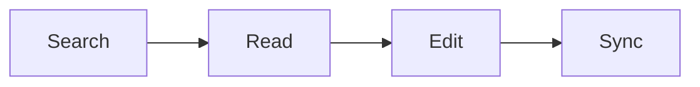

# Dacci Demo

This walkthrough shows the current Dacci CLI, API, Web UI, Docker, and sync surfaces with a small sample knowledge set that can live in the `E2Open.KPE.Content` content repository.

## What this demo covers

| Surface | What you will show |
| --- | --- |
| CLI | Create content, search, export, and inspect sync state |
| API | Read, import, and export over HTTP |
| Web UI | Viewer-first reading, search, tag pills, Mermaid rendering, and management workflows |
| Docker | Packaged API + Web runtime on one host |

## Prerequisites

- Node.js 24+
- npm
- `curl`
- Docker and Docker Compose v2 for the container demo
- optional: `python` for pretty-printing JSON responses

## 1. Prepare the Dacci repo

```bash
npm install
npm run build
npm run typecheck
npm test
```

## 2. Prepare demo content

Create a small import directory with tagged Markdown files and one Mermaid example:

````bash
mkdir -p tmp/demo-import/Deploy/API

cat > tmp/demo-import/Release-Guide.md <<'EOF_RELEASE'
---
tags:
  - release-notes
  - operations
---
# Release Guide

The release freeze starts every Friday at 16:00.

- Validate the deployment checklist
- Confirm rollback ownership
EOF_RELEASE

cat > tmp/demo-import/Rollback-Guide.md <<'EOF_ROLLBACK'
# Rollback Guide

If deployment validation fails, rollback immediately and notify the on-call owner.
EOF_ROLLBACK

cat > tmp/demo-import/Overview.md <<'EOF_OVERVIEW'
# Overview

This topic demonstrates search, import, export, reading, editing, and guarded sync flows.


EOF_OVERVIEW

cat > tmp/demo-import/Deploy/API/Runbook.md <<'EOF_RUNBOOK'
# API Runbook

This nested document demonstrates recursive folder import mapping.
EOF_RUNBOOK
````

Import the demo content:

```bash
npm run cli -- topic create DemoOps
npm run cli -- subtopic create DemoOps Runbooks
npm run cli -- import directory --topic DemoOps --subtopic Runbooks --dir ./tmp/demo-import
npm run cli -- document create --topic DemoOps --name Overview --file ./tmp/demo-import/Overview.md
npm run cli -- tree
```

Result to call out:

- `Deploy/API/Runbook.md` lands logically at `DemoOps/Runbooks - Deploy - API/Runbook.md`
- `Release-Guide.md` includes tags, so `tag:release-notes` has something real to find

## 3. Demo the CLI

```bash
npm run cli -- search rollback
npm run cli -- search freeze
npm run cli -- search tag:release-notes
npm run cli -- document read "DemoOps/Overview.md"
npm run cli -- export topic DemoOps --format bundle-json --output ./tmp/demo-export/topic-bundle.json
npm run cli -- export topic DemoOps --format bundle-zip --output ./tmp/demo-export/topic-bundle.zip
```

Optional round-trip import into a scratch data root:

```bash
mkdir -p tmp/demo-target-data
npm run cli -- --data-root ./tmp/demo-target-data import bundle --file ./tmp/demo-export/topic-bundle.zip
npm run cli -- --data-root ./tmp/demo-target-data tree
```

Show guarded sync status only if the repo is clean and intentionally configured for sync:

```bash
git switch default
npm run cli -- sync status
npm run cli -- sync schedule configure --enable --interval-minutes 15
npm run cli -- sync schedule status
```

## 4. Demo the API

Start the native stack:

```bash
npm run dev
```

Then in a second terminal:

```bash
curl http://localhost:3000/health
curl http://localhost:3000/api | python -m json.tool
curl http://localhost:3000/api/tree | python -m json.tool
curl "http://localhost:3000/api/search?query=rollback" | python -m json.tool
curl "http://localhost:3000/api/search?query=tag:release-notes" | python -m json.tool
```

Demo an API import:

```bash
curl -X POST http://localhost:3000/api/import/documents \
  -H 'Content-Type: application/json' \
  -d '{
    "topicName": "DemoOps",
    "documents": [
      {
        "name": "Imported-From-API.md",
        "body": "# Imported from API\n\nThis document was created by POST /api/import/documents.\n"
      }
    ]
  }' | python -m json.tool
```

Demo an API export:

```bash
curl -X POST http://localhost:3000/api/export \
  -H 'Content-Type: application/json' \
  -d '{
    "scope": "subtopic",
    "topicName": "DemoOps",
    "subtopicName": "Runbooks",
    "format": "bundle-json"
  }' | python -m json.tool
```

## 5. Demo the Web UI

Open:

```text
http://localhost:5173
```

Suggested flow:

1. Call out the `Dacci` header and `Docs as Code. Context Included.` tagline.
2. Search for `rollback`, then `tag:release-notes`.
3. Open `Release-Guide.md` and show the rendered view plus tag pills.
4. Open `Overview.md` and show Mermaid rendering.
5. Use `Expand all`, `Collapse all`, and `Hide documents`.
6. Toggle into edit mode, make a small change, save, and return to view mode.
7. Open the management pane and show import, export, and sync details.
8. Rename or move a document to demonstrate viewer-side quick actions.

## 6. Demo the Docker runtime

```bash
npm run docker:up
curl http://localhost:3000/health
curl http://localhost:3000/ready
curl http://localhost:4173/health
curl http://localhost:4173/runtime-config.json
npm run docker:down
```

## 7. Cleanup

```bash
rm -rf tmp/demo-import tmp/demo-export tmp/demo-target-data
rm -rf data/DemoOps
```
