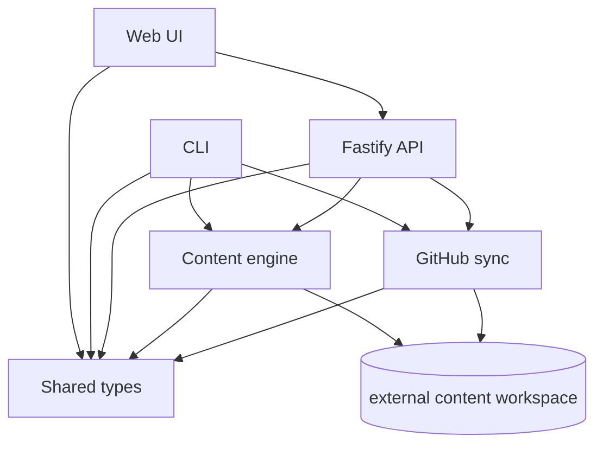
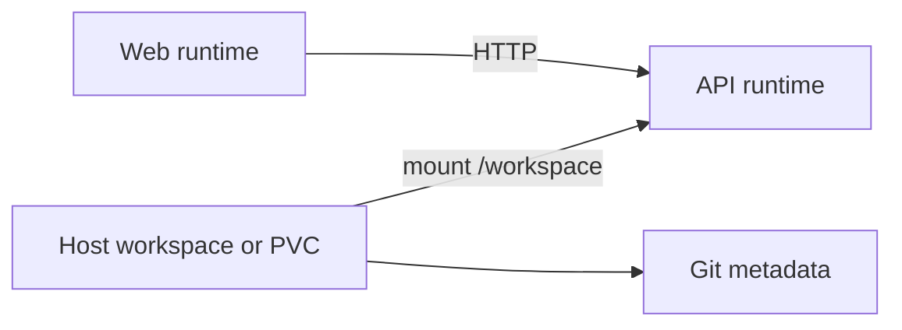

# Current architecture

This document explains why the runtime is split into its current layers and deployment model.

## Architectural intent

The system is designed around one non-negotiable rule: Markdown files in a Git-backed workspace remain the source of truth.

That drives the current architecture:

- filesystem storage instead of a separate database
- shared contracts instead of layer-specific request shapes
- a guarded Git sync boundary instead of sync logic scattered across the app
- packaged runtimes that mount the workspace instead of baking content into images

## Why the layers are separate

| Layer | What it owns | Why it exists separately |
| --- | --- | --- |
| `packages/shared-types` | Cross-layer contracts | Keeps API, CLI, Web, and package boundaries aligned |
| `packages/content-engine` | Filesystem content behavior | Prevents storage rules from leaking into UI and transport layers |
| `packages/github-sync` | Guarded Git operations | Keeps repository safety rules centralized and testable |
| `apps/api` | HTTP transport | Gives the Web UI and future clients one stable integration point |
| `apps/web` | Interactive reader and management UI | Optimizes for human use without owning content rules |
| `apps/cli` | Scriptable operator workflows | Supports automation and batch work without HTTP being required |

## Why the content engine owns the filesystem model

The engine is the only layer that should know about:

- the configured `DATA_ROOT` inside the external content checkout
- path validation rules
- `CatchAll` normalization
- Markdown front matter tag parsing
- import and export bundle structure

That keeps every higher layer focused on intent rather than storage details.

## Why Git sync is a separate boundary

Git operations are not just another kind of content mutation.

They depend on:

- branch state
- upstream configuration
- working tree cleanliness
- ahead/behind state
- non-content changes elsewhere in the repo

Keeping that logic in `packages/github-sync` avoids mixing repository safety decisions into API route handlers, UI state, or CLI argument parsing.

## Why the packaged runtime mounts a workspace

| Decision | Why |
| --- | --- |
| Mount `/workspace` | Content and `.git` must survive restarts |
| `DATA_ROOT=/workspace/data` | Keeps the content engine pointed at the mounted content tree |
| `GIT_SYNC_REPO_ROOT=/workspace` | Lets guarded sync operate on the same checkout as the documents |
| Separate API and Web runtimes | Keeps the Web layer stateless while the API owns content and sync behavior |

## Why Kubernetes stays single-writer

The Kubernetes package is a deployment form of the existing runtime, not a new distributed architecture.

| Decision | Why |
| --- | --- |
| One API replica by default | The workspace and Git checkout are not designed for concurrent writers |
| `Recreate` strategy | Avoids overlapping API pods writing to the same workspace |
| Shared PVC for `/workspace` | Content and Git metadata must move together |
| One ingress host | Keeps browser API routing simple with `WEB_API_BASE_URL=/` |

## Deferred architecture work

The current architecture intentionally does not solve:

- distributed multi-writer coordination
- active-active regional deployment
- advanced observability stacks
- cloud-vendor-specific deployment abstractions

The goal right now is a reliable, explainable Git-backed knowledge workspace, not a generalized distributed platform.
