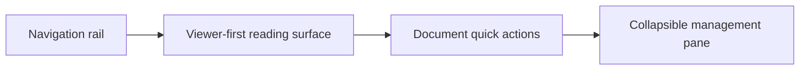

# Current design

This document explains why the current workspace experience is shaped the way it is.

## Core design intent

The product is trying to make a Git-backed Markdown repository feel usable without pretending it is a hosted wiki or a database-backed CMS.

That leads to four design goals:

1. keep the content model easy to understand
2. keep reading separate from management
3. keep automation visible and explicit
4. keep failures obvious instead of hiding them behind optimistic UI behavior

## Why the UI is split the way it is

| Decision | Why it exists |
| --- | --- |
| Viewer-first center panel | Most time is spent reading, not configuring |
| Collapsible management pane | Create/import/export/sync controls matter, but should not dominate the reading experience |
| Navigation rail | Tree browsing, search, and selection need a stable home that does not compete with document content |
| Quick actions near the document title | Save, rename, move, delete, and sync should feel contextual to the selected document |

## Why the content model hides `CatchAll`

The storage layout needs a normalized place for topic-level documents, but end users should think in logical paths, not storage scaffolding.

| Internal need | User-facing expectation |
| --- | --- |
| Topic-level files need a stable on-disk directory | A topic-level document should look like `Topic/File.md` |
| Filesystem rules need consistency | The UI should not expose implementation-only folders |

That is why `CatchAll` remains an internal storage detail.

## Why search and tags stay simple

The current search model favors one clear entry point over multiple overlapping discovery controls.

| Decision | Why |
| --- | --- |
| One search box for path, title, body, and tags | Fewer surfaces to learn and debug |
| `tag:<name>` instead of a separate tag-filter panel | Tags are supported without committing to a more complex search UI yet |
| Tag pills in the reader | Tags should be visible when relevant, but not always consume navigation space |

## Why sync stays explicit

The workspace is built around a real Git repository, so sync actions can conflict with unrelated changes, upstream history, or operator mistakes.

| Decision | Why |
| --- | --- |
| Manual pull and push | Avoid hiding risky repository operations behind background behavior |
| Pull-only scheduler | Pull is safer to automate than push |
| Background sync disabled by default | Safe defaults matter more than convenience |
| Visible blockers and recommendations | Operators need to understand why sync is unsafe, not just see a generic failure |

## Why imports and exports share one transfer model

Import and export are not separate product ideas. They are two sides of the same content transfer problem.

| Decision | Why |
| --- | --- |
| One transfer endpoint | Keeps API and UI behavior consistent |
| JSON bundle and ZIP support | Covers round-trip transfer without inventing multiple content formats |
| Recursive folder mapping | Preserves source intent during bulk import without exposing raw storage details |

## Why the UI prefers reload-after-mutation

The current implementation chooses reliability over aggressive client-side state tricks.

| Decision | Why |
| --- | --- |
| Refresh after successful mutations | Keeps tree, viewer, and management state aligned with the filesystem source of truth |
| Minimal optimistic updates | Reduces subtle desynchronization bugs |
| Explicit success and error messages | Makes mutation results easier to trust |

## Deferred design choices

The following ideas are intentionally deferred because they add complexity faster than they add clarity right now:

- richer tag filtering beyond `tag:` search
- deeper inline help and tooltips
- distributed collaboration workflows beyond guarded Git operations
- heavier client-side state management for optimistic interactions
